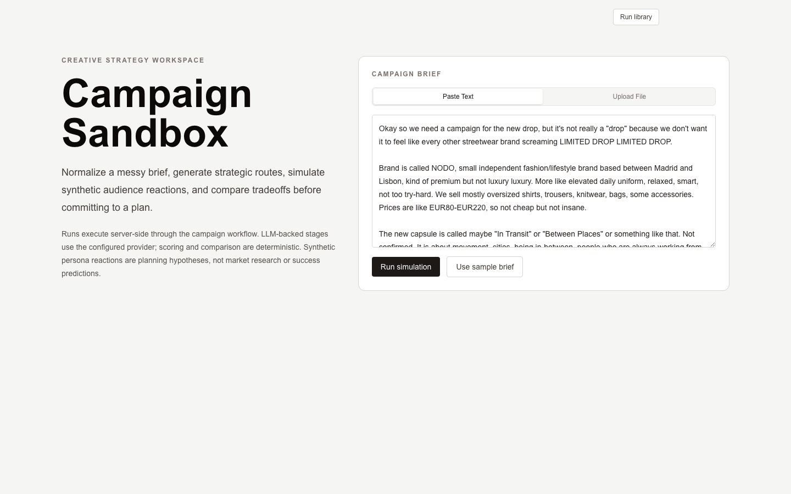
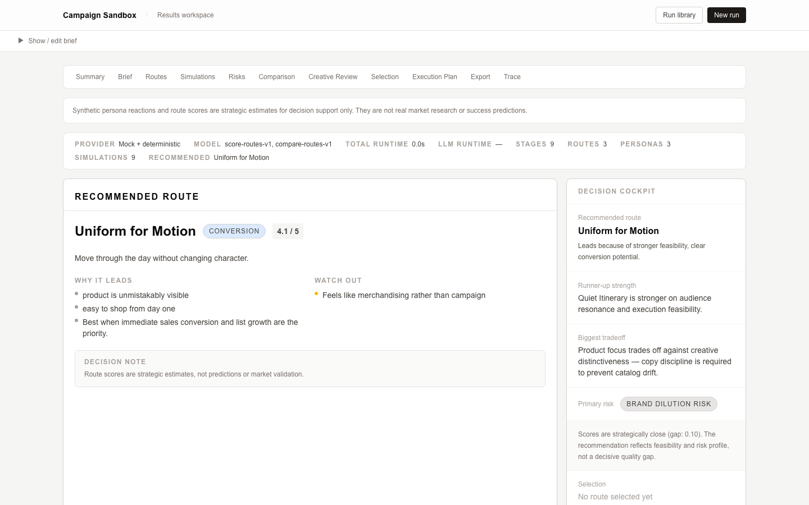
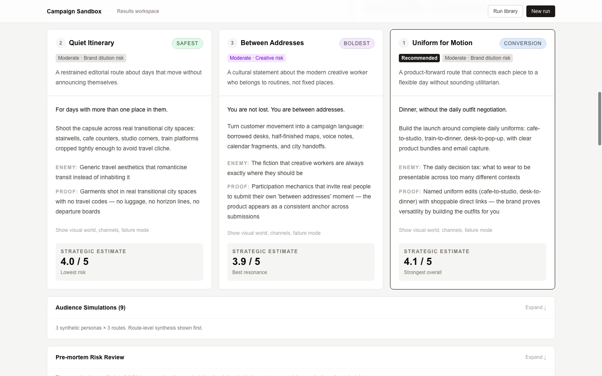
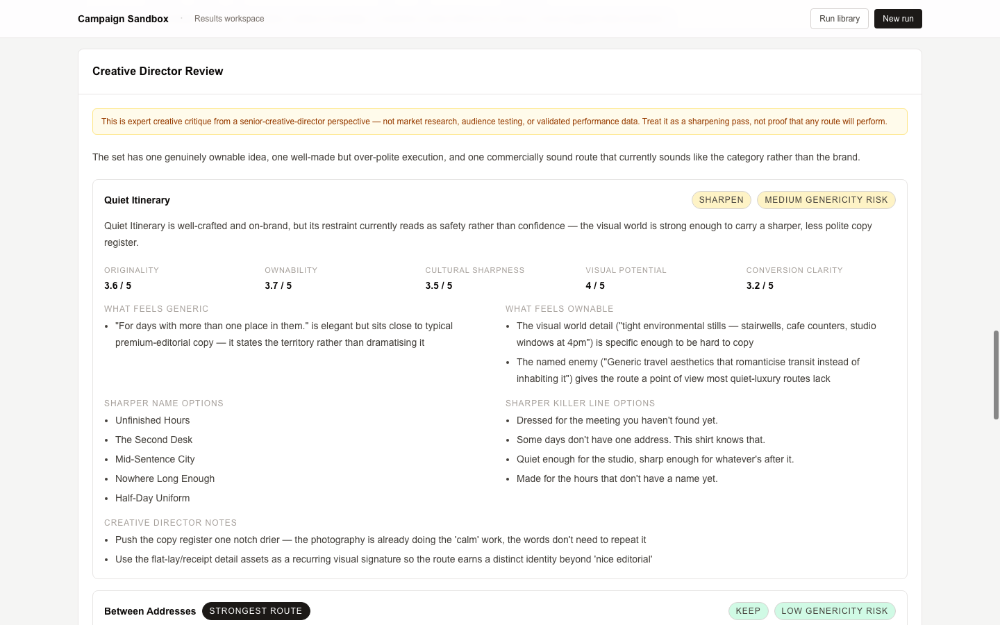
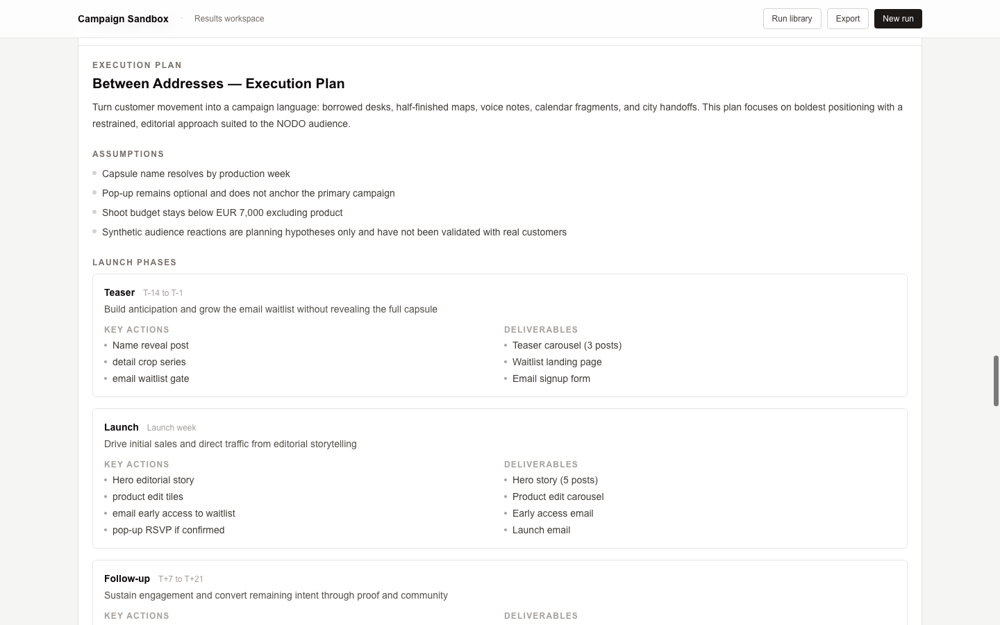
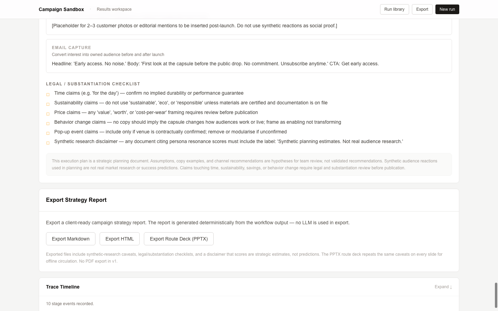

# Campaign Sandbox

[](https://github.com/RaulMermans/campaign-sandbox/actions/workflows/ci.yml)


**AI campaign strategy workspace for turning messy briefs into strategic routes, synthetic audience hypotheses, risk reviews, human-selected plans, and exportable campaign artifacts.**

Campaign Sandbox is an internal creative strategy tool built to support early campaign development without pretending generated output is real market research.

It transforms an unstructured campaign brief into comparable strategic routes, planning hypotheses, route scores, risk reviews, and an execution-ready plan. Human route selection remains mandatory before final plan generation.

It is not an autonomous marketing agent.  
It is not a campaign success predictor.  
It is not a public SaaS product.

---

## Overview

Campaign development often starts with incomplete inputs: a rough brief, a vague audience, a loose objective, and competing creative instincts.

Campaign Sandbox gives that early ambiguity a structured workflow:

- normalize the campaign brief
- identify the strategic tension
- generate distinct campaign routes
- simulate synthetic audience reactions as planning hypotheses
- score route tradeoffs deterministically
- run a pre-mortem and Creative Director Review
- require human route selection
- generate an execution-ready plan
- export the result as Markdown, HTML, or PPTX

The goal is not to automate creative judgment.  
The goal is to make creative judgment easier to compare, document, and defend.

---

## Product snapshot

All screenshots use fictional demo data.

### Brief intake



### Decision cockpit and route comparison



### Campaign route cards



### Creative Director Review



### Execution plan



### Export panel



---

## Core workflow

```text
Messy campaign brief
→ Normalized strategy brief
→ Strategic tension
→ Campaign routes
→ Synthetic audience hypotheses
→ Deterministic scoring + pre-mortem
→ Comparison matrix
→ Human route selection
→ Execution-ready campaign plan
→ Markdown / HTML / PPTX export
```

Human route selection is required before final plan generation.

---

## What it proves

Campaign Sandbox demonstrates:

- AI-assisted creative strategy workflows
- bounded LLM product design
- deterministic scoring and quality gates
- human-in-the-loop campaign decision-making
- synthetic audience planning with explicit caveats
- structured route comparison
- pre-mortem and creative critique workflows
- exportable strategy artifact generation
- internal tool architecture with local saved runs
- product thinking at the intersection of brand, marketing, and AI systems

The project is not valuable because it generates campaign ideas.

It is valuable because it shows how campaign strategy can be structured into a repeatable decision-support workflow.

---

## Key system ideas

### Human-gated route selection

Campaign Sandbox does not move directly from generated routes to a final plan.

The system presents route options, tradeoffs, scores, risks, and audience hypotheses. A human must explicitly select the route before execution planning begins.

This keeps the workflow strategic rather than autonomous.

---

### Synthetic audience hypotheses

The audience simulation layer produces planning hypotheses, not research claims.

Synthetic reactions are framed as directional inputs for internal strategy review. They are not survey data, focus group findings, measured demand, or performance predictions.

---

### Deterministic scoring

Route scores are bounded strategic estimates generated from explicit scoring dimensions.

They help compare options, but they are not probabilities and are not calibrated against historical campaign performance.

---

### Creative Director Review

The Creative Director Review functions as a critique layer.

It reviews each route for:

- strategic clarity
- emotional sharpness
- creative distinctiveness
- risk exposure
- execution tension
- proof and claim integrity

This gives the strategist a second-pass lens before committing to a route.

---

### Proof-integrity checks

Campaign Sandbox blocks unsupported proof claims at generation and export boundaries.

The system is designed to avoid unsupported testimonial, validation, or outcome language such as:

- fake social proof
- invented audience validation
- unsupported performance claims
- implied research that never happened

---

### Exportable strategy artifacts

The final output can be exported as:

- Markdown strategy report
- standalone HTML strategy report
- PPTX route deck

Exports repeat the synthetic-data and human-selection caveats, so the artifact remains clear when shared outside the app context.

---

## Architecture

Campaign Sandbox uses a hybrid deterministic/LLM architecture.

| Layer | Responsibility |
|---|---|
| Deterministic workflow | Orchestration, schemas, retries, validation, trace logging |
| Strategy brief normalization | Converts messy inputs into structured campaign context |
| Campaign route generation | Produces distinct strategic options |
| Synthetic audience layer | Generates planning hypotheses with caveats |
| Scoring engine | Applies bounded deterministic scoring weights |
| Risk review | Runs pre-mortem and Creative Director critique |
| Human selection gate | Requires explicit route choice before final planning |
| Export system | Produces Markdown, HTML, and PPTX artifacts |
| Local run library | Saves recent runs in browser-local storage |
| Internal access layer | Keeps deployed usage controlled |

---

## Project highlights

| Area | Highlights |
|---|---|
| Strategy workflow | Brief normalization, tension extraction, route generation |
| Decision support | Route comparison matrix, scoring, human selection |
| Creative critique | Pre-mortem and Creative Director Review |
| Audience planning | Synthetic personas and reactions with explicit caveats |
| Guardrails | Proof-integrity checks and human-gated execution planning |
| Export | Markdown, HTML, and PPTX strategy artifacts |
| Interface | Intake, route cards, decision cockpit, plan view, export panel |
| Testing | Typecheck, lint, tests, and build verification in CI |

---

## Reliability model

Campaign Sandbox is designed as decision support, not prediction.

Key boundaries:

- synthetic personas are not real people
- synthetic reactions are not market research
- route scores are not success probabilities
- generated plans require human review
- proof claims are checked before export
- campaign outputs are framed as strategy artifacts, not guaranteed outcomes

This distinction is central to the product: AI can help structure strategic thinking, but it should not manufacture certainty.

---

## Technical stack

- Next.js App Router
- React
- TypeScript
- Tailwind CSS
- Zod
- server-side structured generation layer
- Vitest
- deterministic Markdown / HTML / PPTX export
- GitHub Actions CI

---

## Testing and CI

The public repository is designed to be reviewable without requiring live provider access.

CI runs the verification workflow in mock-safe mode:

- typecheck
- lint
- tests
- production build

This keeps the repo suitable as a public portfolio artifact without exposing secrets or requiring cost-bearing execution.

---

## Limitations

Campaign Sandbox is intentionally scoped.

Current limitations:

- Synthetic personas and reactions are not validated market research.
- Route scoring is not calibrated against historical campaign performance.
- PDF extraction depends on selectable text and may vary by runtime.
- Saved runs are browser-local and capped.
- There is no shared workspace or multi-user collaboration layer.
- Long-running LLM stages are synchronous in v1.
- The access layer is shared internal control, not full user identity management.

---

## Project structure

```txt
app/
  pages, access UI, and API routes

components/
  intake, route, simulation, decision, plan, and export UI

lib/schemas/
  workflow contracts

lib/workflow/
  deterministic orchestration, stages, scoring, and quality gates

lib/llm/
  server-side provider adapter and structured generation

lib/export/
  Markdown, HTML, and PPTX renderers

lib/storage/
  browser-local run library

prompts/
  bounded LLM prompt files

workflows/
  workflow definition

docs/
  architecture, safety, deployment, and case study
```

---

## Portfolio case study

A deeper write-up of the product decisions, architecture, reliability model, and lessons learned is available here:

```txt
docs/case-study.md
```

---

## Portfolio summary

Campaign Sandbox is a portfolio project about AI-assisted creative strategy.

It shows how a campaign workflow can move from ambiguity to structured options, from generated ideas to human selection, and from strategic thinking to exportable business artifacts.

The central design principle is simple:

> AI can expand the strategy space, but humans choose the route.
